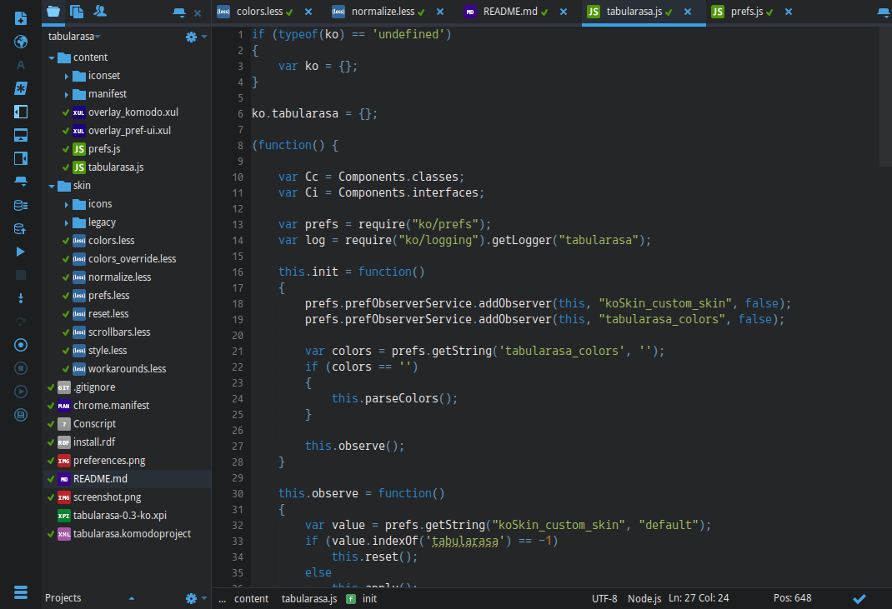

This is a color preset for the [Tabula Rasa] skin. It's based on the [Abyss skin](http://komodoide.com/packages/skins/abyss/), which was originally introduced in Komodo 8.5.

## Installation and Usage

 * install [Tabula Rasa]
 * Go to Preferences > Appearance
 * Select the "Tabula Rasa" skin and Iconset
 * Hit the "Import" button under "Skin Colors"
 * Select the file you downloaded here and press Ok
 
For best results I've included the Railscast_Abyss color scheme, which is a lightly modified version of the Railscast_Dark Color scheme.

   [Tabula Rasa]: http://komodoide.com/packages/skins/tabula-rasa/
